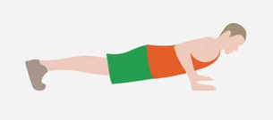

工作每天都在坐，没有时间做运动，曾经做过很多不同运动的尝试，e.g. 游泳， 跑步 etc.

减下来一段时间就又胖回去。

去健身房健身，时间耗不起

无意中看到一款7分钟运动，尝试的心态试一下，结果1个月减了20斤， 极力推荐。

---

7 分钟运动法，是一组 12 个动作训练。

---

1. 开合跳 30 秒（有氧训练)

- 双手弯曲举过头顶
- 双脚展开呼气，合拢吸气
- 开始尽量慢点，跳高一点，后面速度加快

2. 无影凳 30 秒（阻力训练）

- 背部靠在墙面，身体慢慢向下坐；
- 背部与大腿呈 90 度，大腿与小腿呈 90 度；
- 膝盖不要超过脚尖。

3. 俯卧撑 30 秒（阻力训练）

- 女生如果不够力可以用膝盖撑地

4. 卷腹 30 秒（核心稳定力量训练）

 

- 下背部不要离地

- 动作的质量比数量重要，尽量放慢速度

- 不要抱头，不要用颈部力量将身体拉起，避免造成颈椎受伤

5. 踏凳 30 秒（阻力训练）

- 利用凳子双脚交替进行。

6. 蹲伏 30 秒（阻力训练）

- 双脚与肩膀同宽；
- 臀部慢慢向下、往后坐；
- 膝盖一般不超过脚尖。

7. 三头肌撑体 30 秒（阻力训练）

- 利用凳子，双手支撑
- 手肘弯曲呈 90 度

8. 平板支撑 30 秒（核心稳定力量训练）

       
- 手肘撑地，手肘与地面呈 90 度
- 保持身体呈一条直线
- 夹紧臀部，收缩小腹

9. 原地提膝踏步 30 秒（有氧训练）

- 膝盖尽量向上抬，双腿抬至水平；
- 上身挺直；

10. 弓步 30 秒（阻力训练）

- 上身挺直，右脚向前跨出一大步，身体顺势下蹲，屈膝呈 90 度
- 膝盖不要超过脚尖，脚跟抬起
- 利用前脚力量归位
- 双脚交替进行
        

11. 掌上压后转身 30 秒（阻力训练）

- 掌上压以后，手臂向上展开
- 双侧交替进行。

12. 左侧身撑身体 30 秒（核心稳定力量训练）

- 手肘90° 垂直地面
- 如果太难就双脚分开

13. 右侧身撑身体 30 秒

- 跟左侧动作对应
        
 每个动作都做 30 秒，两个动作之间休息 10 秒，加起来正好 7 分钟左右。

每天运动 7 分钟, 不要再为自己找没有时间运动的借口， 从今天开始，坚持你就看到成果！

