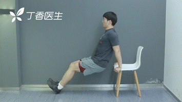

现在，越来越多人逐渐体会到了运动的重要性，但又有了新的苦恼：

每天工作太忙了，根本抽不出一两个小时去跑步、去健身房。

其实呢，运动时间长度不是最重要的。只要练得科学，也能达到锻炼效果。

今天，我们就来介绍一种受到运动医学界的权威——美国运动医学会（ACSM）推荐的运动法。

每天只需要 7 分钟，就能练出好身材。

---

7 分钟运动法，是一组包含了 12 个重要动作的高强度循环训练。

研究人员做过实验，让 29 名 18～30 岁的被试者每天只额外做一次 7 分钟训练，期间所有人不节食。6 周后，结果显示：

参与者平均体脂率降低了 2.1%，甩掉了 3.6 斤脂肪；

平均腰围也从 88.1 厘米缩短到了 82.1 厘米。

7 分钟左右，完成 12 个动作，每个动作耗时 30 秒，重复 15～20 次。完成一个动作之后，休息 10 秒，再开始下一个动作。

以此类推，7分钟完成全部动作后，你会明显感觉到呼吸加速，心跳加快。根据个人情况，可选择性重复 2～3 遍 7 分钟运动。

12个动作的顺序非常重要，它把运用同一组肌群的动作交替间隔开，给了不同肌群轮流休息的机会

### 1. 开合跳 30 秒（有氧训练)

- 挺立、双腿并拢，双手放在身体两侧

- 轻轻跳起来，双脚往外的同时双手往上拍

- 归位后，双脚合并，双手归回身体两侧

- 如果有肩颈酸痛问题，只需将手抬至与肩同高即可

### 2. 靠墙静坐 30 秒（阻力训练）

背部靠在墙面，身体慢慢向下坐；

背部与大腿呈 90 度，大腿与小腿呈 90 度；

膝盖不要超过脚尖。

### 3. 俯卧撑 30 秒（阻力训练）

- 双手扶地，保持身体呈一条直线；

- 下压时肩关节低于肘关节；

- 女生如果肌力不够，可以采用跪姿；

- 男生做能强健胸肌，女生则可以告别副乳和蝴蝶袖。
### 4. 卷腹 30 秒（核心稳定力量训练）

- 用腹部的肌肉让肩胛骨离开地面呈 45 度即可，无需身体完全坐起（不是仰卧起坐）；

- 动作的质量比数量重要，尽量放慢速度；

- 避免抱头，不要用颈部力量将身体拉起，避免造成颈椎受伤。

### 5.踏凳 / 上台阶 30 秒（阻力训练）

- 一只脚踩住椅子或台阶，身体自然向上；

- 上半身挺直；

- 双脚交替进行。

### 6.徒手深蹲 30 秒（阻力训练）

- 双脚与肩膀同宽；
      
- 臀部慢慢向下、往后坐；
      
- 膝盖一般不超过脚尖。

### 7. 三头肌撑体 30 秒（阻力训练）

- 找一个座椅，双手支撑，身体背对座椅；
       
-  双脚脚跟着地，身体慢慢自然下降；
       
-   手肘弯曲呈 90 度。
       

### 8. 平板支撑 30 秒（核心稳定力量训练）

       
- 手肘撑地，手肘与地面呈 90 度；
       
- 保持身体呈一条直线；
       
- 夹紧臀部，收缩小腹。

### 9. 原地高抬腿 30 秒（有氧训练）

- 膝盖尽量向上抬，双腿抬至水平；

- 上身挺直；

- 注意同时摆臂。

### 10. 弓箭步 30 秒（阻力训练）

-    上身挺直，右脚向前跨出一大步，身体顺势下蹲，屈膝呈 90 度；
        
-    膝盖不要超过脚尖，脚跟抬起；
        
-    利用前脚力量归位；
        
-   双脚交替进行。
        

### 11.T 形俯卧撑 30 秒（阻力训练）

-  俯卧撑一次后，举起一侧手臂，身体顺势转向侧面呈 T 字形；
       
-  双侧交替进行。

### 12. 侧向平板支撑 30 秒（核心稳定力量训练）

-   单侧手肘与脚着地，上臂与身体垂直；
        
-   脊柱挺直，双腿伸直；
        
-   收紧腹部和臀部，利用核心肌群保持静态动作；
        
-   双侧交替进行。
        
        
 每个动作都做 30 秒，两个动作之间休息 10 秒，加起来正好 7 分钟左右。

每天运动 7 分钟，就可以为自己培养一个轻度的运动习惯。

改变，什么时候开始都不算太晚。

