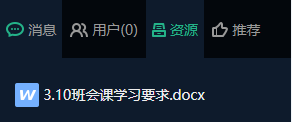
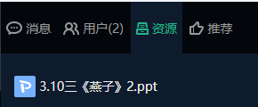
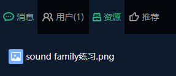
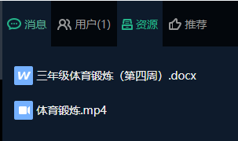

# 课程表

## 今日课程
| 时间  | 周二内容  | 视频 以下视频如果有问题到点播平台点播[点播地址](http://tw.xttjzx.com/liveplatform/twliveLogin/toLogin)| 附加内容 |
|---|---|---|---|
| 9:00-9:20 | 班会：3.10三年级班会|<video id="video" controls="" preload="none" style="width=200px; height:100px"><source id="mp4" src="http://cdn.teewonyun.com//Z000001/2020/3/9/mp4/8f9f417c-ff3c-412b-99e8-55d8bb9acaa7.mp4" type="video/mp4"></video>|<li>[3.10班会课学习要求.docx](http://cdn.teewonyun.com//Z000001/2020/3/9/docx/a410323c-aeed-4e4f-85cb-0a7cccf0f77e.docx)</li>|
| 9:20-9:40  | 自习 | 语文答疑群（QQ群） QQ 扫描 </img>||
| 9:40-9:50 | 课间休息 | ||
| 9:50-10:10 | 语文: 3.10三年级语文《燕子》2|<video id="video" controls="" preload="none" style="width=200px; height:100px"><source id="mp4" src="http://cdn.teewonyun.com//Z000001/2020/3/9/mp4/a5bfb246-a83e-48e7-9bc5-4141d62b1310.mp4" type="video/mp4"></video> |<li>[3.10三《燕子》2.ppt](http://cdn.teewonyun.com//Z000001/2020/3/9/ppt/e112a072-0501-471b-b2b4-9b178e5dd6eb.ppt)</li>|
| 10:10-10:30| 练习与答疑| 数学答疑群（QQ群） QQ 扫描 </img>||
| 10:30-10:45| 眼保健操/课间休息|||
| 10:45-11:05| 英语：3.10三年级英语Unit 1《I like red》3|<video id="video" controls="" preload="none" style="width=200px; height:100px"><source id="mp4" src="http://cdn.teewonyun.com//Z000001/2020/3/9/mp4/a8fd208e-5b82-45ef-b163-79a40901ac04.mp4" type="video/mp4"></video> |<li>[sound family练习.png](http://cdn.teewonyun.com//Z000001/2020/3/9/png/0e68b269-77db-431c-9241-832c3598ef2b.png)</li>|
| 11:05-11:25| 练习与答疑| 英语答疑群（微信群） 微信 扫描 </img> ||
| 11:25-11:55| 体育锻炼| <video id="video" controls="" preload="none" style="width=200px; height:100px"><source id="mp4" src="http://cdn.teewonyun.com//Z000001/2020/3/6/mp4/2fdf7c9f-75a6-4ed3-aae7-843d6c61d488.mp4" type="video/mp4"></video> ||
| 12:00-14:30| 午休| ||
| 14:30-14:50| 体育与健康：3.10三年级体育|<video id="video" controls="" preload="none" style="width=200px; height:100px"><source id="mp4" src="http://cdn.teewonyun.com//Z000001/2020/3/6/mp4/2fdf7c9f-75a6-4ed3-aae7-843d6c61d488.mp4" type="video/mp4"></video> | 去[微课堂](http://tw.xttjzx.com/liveplatform/twliveLogin/toLogin)|
| 14:50-15:50| 练习与答疑(语英)| ||
| 15:50-16:05|  眼保健操/课间休息| ||
| 16:05-16:35| 家庭体育锻炼| ||
| 16:35-17:05| 家务劳动与实践活动| ||

## 微课
### [点播地址](http://tw.xttjzx.com/liveplatform/twliveLogin/toLogin)

## 答疑群

### - 语文答疑群（QQ群）

QQ 扫描

</img>

### - 数学答疑群（QQ群）

 QQ 扫描

 </img>

### - 英语答疑群
（微信群）
  微信 扫描

  </img>

  (QQ群)
   QQ 扫描

   </img>

## 交作业

### 老师助手
QQ 扫描

</img>

