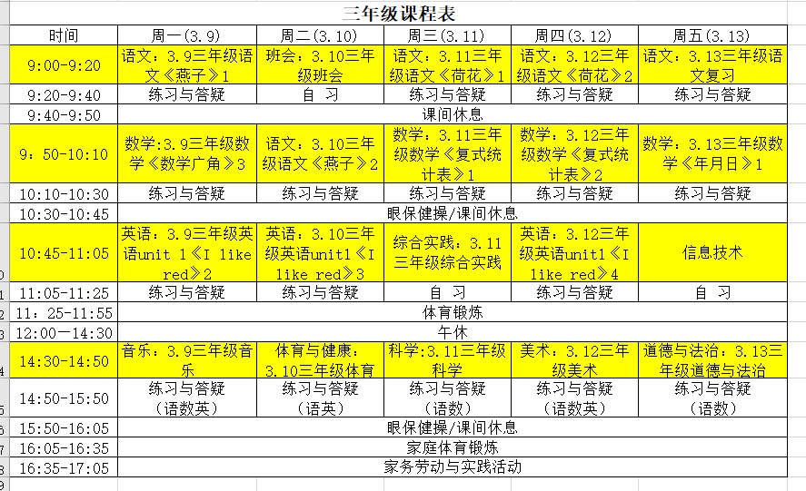

# 课程表

| 时间  | 周一内容  | 内容|
|---|---|---|
| 9:00-9:20   | 语文:3.9 三年级语文《燕子》1 |<video id="video" controls="" preload="none" style="width=200px; height:100px"><source id="mp4" src="http://cdn.teewonyun.com//Z000001/2020/3/8/mp4/6d9f1b94-cd3a-4202-b816-514671a045e4.mp4" type="video/mp4"></video>|
| 9:20-9:40  | 练习与答疑 | 语文答疑群（QQ群）QQ 扫描</img>|
| 9:40-9:50 | 课间休息 | |
| 9:50-10:10 | 数学: 3.9三年级数学《数学广角》3| |
| 10:10-10:30| 练习与答疑| 数学答疑群（QQ群）QQ 扫描</img>|
| 10:30-10:45| 眼保健操/课间休息||
| 10:45-11:05| 英语：3.9三年级英语Unit 1《I like red》2|<video id="video" controls="" preload="none" style="width=200px; height:100px"><source id="mp4" src="http://cdn.teewonyun.com//Z000001/2020/3/6/mp4/a2748c6f-ee47-461b-9c4d-eb967bb24edb.mp4" type="video/mp4"></video> |
| 11:05-11:25| 练习与答疑| 英语答疑群（微信群）微信 扫描</img> |
| 11:25-11:55| 体育锻炼| |
| 12:00-14:30| 午休| |
| 14:30-14:50| 音乐：3.9三年级音乐| |
| 14:50-15:50| 练习与答疑(语数英)| |
| 15:50-16:05|  眼保健操/课间休息| |
| 16:05-16:35| 家庭体育锻炼| |
| 16:35-17:05| 家务劳动与实践活动| |

## 微课
### [点播地址](http://tw.xttjzx.com/liveplatform/twliveLogin/toLogin)

## 答疑群

### - 语文答疑群（QQ群）

QQ 扫描</img>

### - 数学答疑群（QQ群）

 QQ 扫描</img>

### - 英语答疑群（微信群）
  微信 扫描</img>

## 交作业

### 老师助手
QQ 扫描</img>

