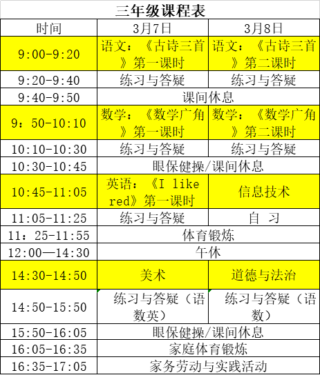

# 课程表

## 微课
### [点播地址](http://tw.xttjzx.com/liveplatform/twliveLogin/toLogin)

### 内容

- 语文

    - 第一课

    [307三《古诗三首》](/307_1.pptx)

- 数学

    [《数学广角》第一课时（稍复杂的排列问题）](/307_math_1.pptx)

## 答疑群

### - 语文答疑群（QQ群）

QQ 扫描</img>

### - 数学答疑群（QQ群）

 QQ 扫描</img>

### - 英语答疑群（微信群）
  微信 扫描</img>

## 交作业

### - 语文，数学在老师助手
QQ 扫描</img>

### - 英语在微信群交作业

把所有作业放在一起拍一张照片

微信 扫描</img>
